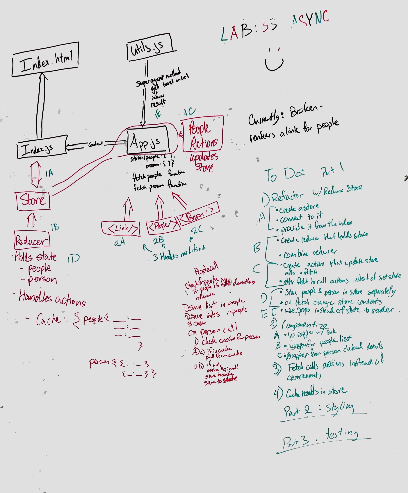

 Lab 33: Remote APIs  
============================================================================    
Date: May 1st, 2019    
Author: Aaron Ferris  
  
UMLs Completed with: Erin Trainor, Jon Gentry, Spencer Hirata   

[Code Sandbox Link](https://codesandbox.io/s/github/abferris/lab33)
[Pull request](https://github.com/abferris/lab33/pull/1)  
[LAB INSTRUCTIONS](./LAB.md)  

## Assignment  
### Refactor A Star Wars Lookup App  
[x] Convert the current react component state to use a Redux Store  
  [x]  Create a store  
  [x]  Connect to it, create it, provide from the index  
  [x]  Connect to it from the component  
  [x]  Create a reducer that holds the state  
  [x]  Create actions that update the store after a fetch  
  [x]  Alter your fetch to call those actions instead of doing a `setState()`  
  [x]  Have a store for holding all people and a store for holding state of 1 person  
  [x]  On each fetch, change the contents of the store.  
  [x]  Alter the rendering function to use props instead of state  
* Break the app into multiple components  
  * A wrapper that has the link  
  * A lister that shows the people  
  * A detailer that shows the person after being clicked on  
* Convert the native `fetch...()` calls from being in the components to instead invoking action methods  
  * These should return functions that dispatch the real action  
  * You'll need to have `thunk` in place to make this work  
[x] Cache the results in the store  
  [x] Once you're all wired up, alter the stores to hold onto state as you fetch things. This way, when you start clicking on people more than once, you don't end up going out to the API to get their data.  
  
### Styling  
* Clearly, this needs a little bit of TLC  
* Use your generic design to apply core styling and layout  
* Use your creativity ...  
  * A pop-up modal for the details instead of a simple list?  
  * Accordions?  
  * Slide Out?  
  * Rotator?  
  
### Testing  
* tests that ensure the list module functions correctly with error-check parameters  
  
## Part 1: Connect to a Store    
    
[part 1 Details](./PART1.md)    
    
### Sandbox Submission  
    
[part one sandbox](https://codesandbox.io/s/n771jx0mz0)    
  
  
  
